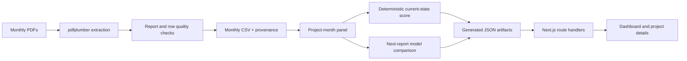

# Architecture and data flow

PARAKH is a local research prototype. It ingests monthly MoSPI project reports, preserves row-level source references, builds a longitudinal panel, and serves a Next.js dashboard. It is not connected to a live MoSPI feed and does not dispatch official alerts.

## Pipeline stages

1. `src/pdf_extracter.py` discovers reports under `data/pdfs/`, routes supported report layouts, extracts project tables, and records source file/page.
2. `src/data_loader.py`, `src/pipeline.py`, and the quality checks normalize monthly records and build the project-month panel. Parseable warnings are preserved and surfaced in generated quality reports.
3. `src/features.py` calculates deterministic current-state signals and the weighted rule score. Rows missing required inputs or failing verification do not silently become verified risk results.
4. `src/labels.py` builds next-report outcomes; `src/model_train.py` compares explainable baseline and ensemble candidates with grouped and chronological evaluation.
5. `src/export_for_backend.py` writes the dashboard snapshot and metrics to `data/processed/`.
6. Next.js pages and route handlers read those generated artifacts. Project detail views can link to the original PDF page through the source endpoint.

## Current coverage and trust boundary

The extraction quality manifest records 17 report runs: four OCMS reports from March–June 2025 and thirteen PAIMANA reports from July 2025–July 2026. All 17 source PDFs are present under `data/pdfs/`. The generated quality artifact records 25,180 extracted rows; 64 rows without an official ID remain in source CSVs and are excluded from the 25,116-row panel. Quality status is report-specific: 7 outputs are `VERIFIED`, 10 are `REVIEW_REQUIRED`; warnings and unresolved OCMS revised-cost reconciliation remain visible in the audit. See [the extraction audit](PAIMANA_EXTRACTION_PHASE1_AUDIT.md).

Cross-month identity uses official project IDs; uncertain identity is not guessed. Portfolio totals and counts are corroborating checks, not proof that every field is correct. Any new report format needs its own source-page sample verification and reconciliation before being treated as verified.

## Runtime

The Python pipeline writes static JSON data consumed by the Next.js application. The app uses Next.js App Router, React, and Recharts. There is no separate Express service, production database, live external model API, or government integration in the current prototype. Run commands are in the root [README](../README.md).
